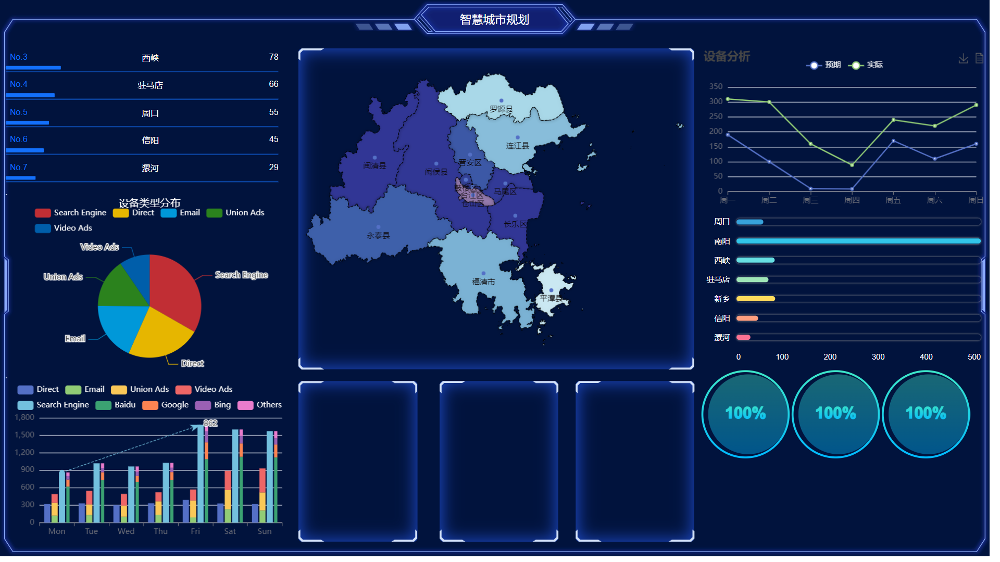

# datav-demo
## 查看更多,使用教程前往[博客](https://blog.csdn.net/qq_45502336/article/details/124394458)

## 展示图片：


## Project setup
```
npm install
```

### Compiles and hot-reloads for development
```
npm run serve
```

### Compiles and minifies for production
```
npm run build
```

### Customize configuration
See [Configuration Reference](https://cli.vuejs.org/config/).
